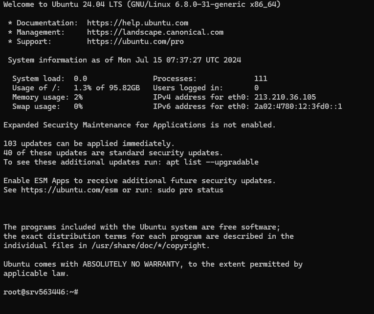

-------------------------------------------------------------------------

# how to setup vps surver in Hostinger: 

## 0.0 Setup the VPS 

1. You have the VPS Information Panal then i will teach you how too do ? 
2. open the your cammand line make sure this: C:\Users\Manjusha Kumari> 
paste the SSH Success Terminal in the command line and then password,


you show this interface:



3. before installing any software, it's good practice to update your VPS packages:

``` 
    # sudo apt update 
    # sudo apt upgrade
```

## 0.1  This is once time Setup 

### 1. first we will install the NVM (Node version Manger) because how to manage the version of package, so we need of this nvm 


```
# curl -o- https://raw.githubusercontent.com/nvm-sh/nvm/v0.39.7/install.sh | bash
```
if you check the version: nvm --version then you get this: Command 'nvm' not found, but there are 14 similar ones.

exit code:
 ```
# exit
```

you should restart the again your command line and enter the ssh Terminal and password 
then you write the 

```
# nvm --version
``` 


### 2. Install the node 

```
# nvm install --lts

```
lts -> long term support 

check the verion

```
# node -v
```

### 3. install the Git 

```
# sudo apt install git
```


if you connect github to your project  
then install the cli of github 

```
# sudo apt install gh
```


Authenticate the your github in nvm 

```
# gh auth login
```


## 0.3 This is connection of Project 

1. you should clone the project 

```
git clone https://github.com/ProgramerSalar/noise-json.git
```

and then go to the project like 

```
cd <your-project-name>
```


you use the ls command then you know the file information


you should install the pnpm because it's need to install the package 

```
# npm i pnpm --global
# pnpm i
```

